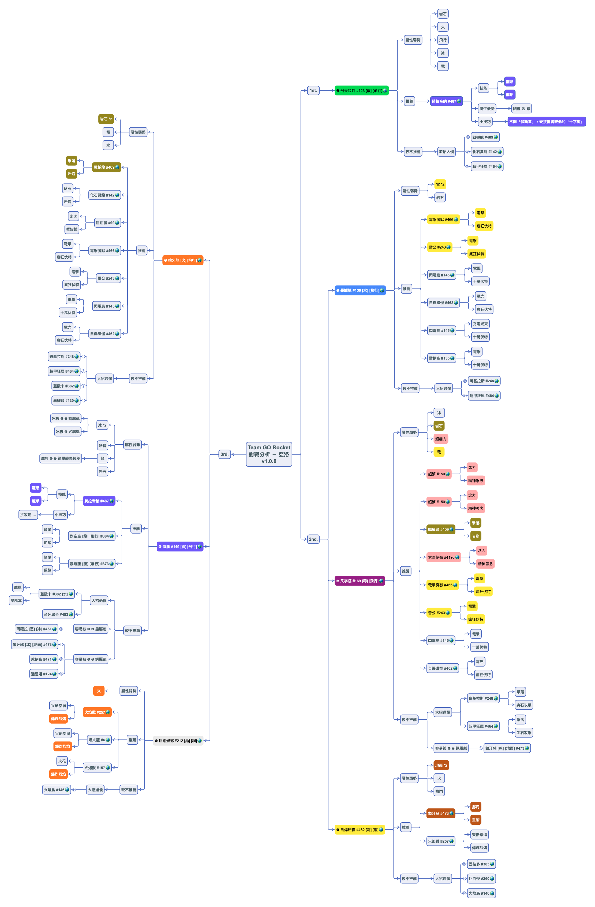

# GO Rocket 對戰分析

   

為更順利地的擊敗 [Pokemon GO](https://pokemongolive.com/zh_hant/) 中的各個火箭隊手下和幹部，故進行此對戰分析。凍仁將不定期更新，敬請期待。

## 手下

* [Pokemon GO 火箭隊入侵筆記 | HackMD](https://hackmd.io/qT1r_q_GTTmge49SzetfnQ#%E9%9B%9C%E9%A0%85) by Rplus

## 幹部 (Leaders)

> GO 火箭隊幹部克里夫、希爾拉和亞洛已於 2019/11/08 登場，只要打敗 6 名 GO 火箭隊手下，即可蒐集 6 個神秘零件組裝成火箭隊雷達，並與幹部進行對戰！

### 克里夫 (CliffArlo)

待續。

### 希爾拉 (Sierra).

待續。

### 亞洛 (Arlo)

----

## 參考資料

* [找出 GO 火箭隊的幹部，並打倒阪木老大！ | Pokémon GO](https://pokemongolive.com/zh_hant/post/teamgorocketleaders2019/)
* [《Pokemon GO》迎戰 GO 火箭隊幹部克里夫、希爾拉和亞洛！阪木老大同步現蹤《Pokémon GO》 | 巴哈姆特](https://gnn.gamer.com.tw/detail.php?sn=188322)
* [GO 火箭隊隊長指南：尋找方式、派出寶可夢 | Pokemon Hubs 寶可夢](https://www.pokemonhubs.com/pokemongo/8878/)
* [Pokémon GO | gameinfo.io](https://pokemon.gameinfo.io/zh-tw)
* [道館館主「亞洛」 | The official Pokémon Website in Asia](https://swordshield.portal-pokemon.com/tc/character/02.html)
