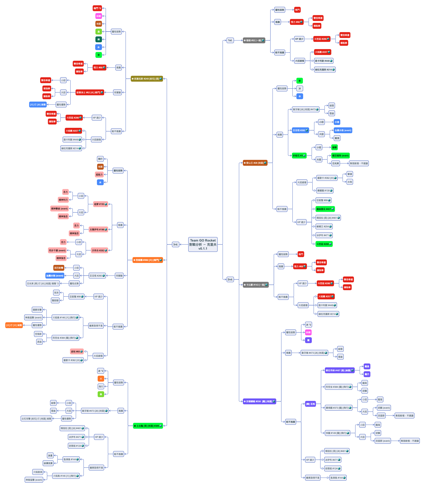
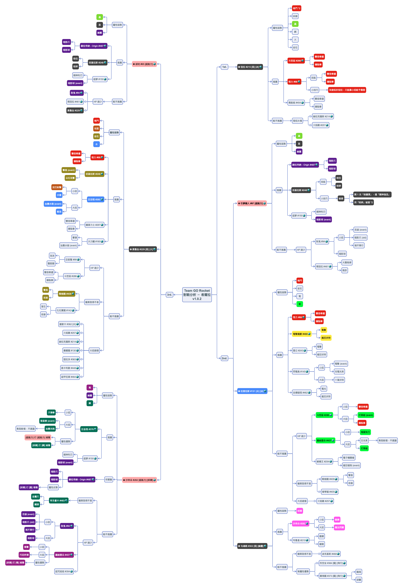
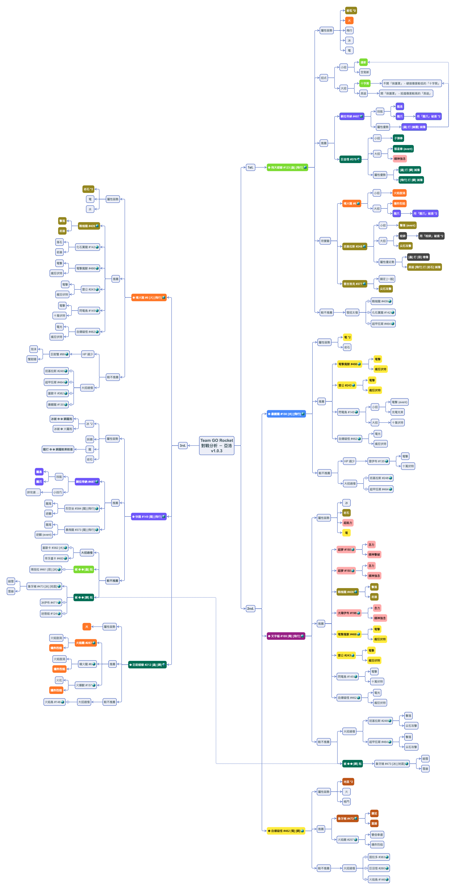

# GO Rocket 對戰分析 / 幹部 (Leaders)

   

為更順利地的擊敗 [Pokemon GO](https://pokemongolive.com/zh_hant/) 中的各個火箭隊手下和幹部，故進行此對戰分析。凍仁將不定期更新，敬請期待。

> GO 火箭隊幹部克里夫、希爾拉和亞洛已於 2019/11/08 登場，只要打敗 6 名 GO 火箭隊手下，即可蒐集 6 個神秘零件組裝成火箭隊雷達，並與幹部進行對戰！

## 克里夫 (CliffArlo)

[cliffarlo_mindmap_v0.1.1.png](png/cliffarlo_mindmap_v0.1.1.png)

### Changes

* v0.1.1:
 1. 調整**待實驗**位置。
* v0.1.0:
 1. 2019/11/10 完成第 1 次分析，但尚未進行實戰驗證。

## 希爾拉 (Sierra).

[sierra_mindmap_v1.0.2.png](png/sierra_mindmap_v1.0.2.png)

### Changes

* v1.0.2:
 1. 調整**待實驗**位置。
* v1.0.1:
 1. 幫部份 [屬性] 上色。
 1. 加入**HP 過少**判斷。
 1. 新增暗影球超夢。
* v1.0.0:
 1. 2019/11/10 完成第 1 次分析。

## 亞洛 (Arlo)

[arlo_mindmap_v1.0.3.png](png/arlo_mindmap_v1.0.3.png)

### Changes

* v1.0.3:
 1. 新增**巨金怪**、**噴火龍**、**班基拉斯** vs. 飛天螳螂組合。
 1. 調整**待實驗**位置。
* v1.0.2:
 1. 加入**HP 過少**判斷。
* v1.0.1:
 1. 新增**電吉洛克** vs. 飛天螳螂 (待驗證)。
 1. 變更鋼屬性顏色 (灰 → 深綠)。
* v1.0.0:
 1. 2019/11/10 完成第 1 次分析。

----

## 參考資料

* [找出 GO 火箭隊的幹部，並打倒阪木老大！ | Pokémon GO](https://pokemongolive.com/zh_hant/post/teamgorocketleaders2019/)
* [《Pokemon GO》迎戰 GO 火箭隊幹部克里夫、希爾拉和亞洛！阪木老大同步現蹤《Pokémon GO》 | 巴哈姆特](https://gnn.gamer.com.tw/detail.php?sn=188322)
* [GO 火箭隊隊長指南：尋找方式、派出寶可夢 | Pokemon Hubs 寶可夢](https://www.pokemonhubs.com/pokemongo/8878/)
* [Pokémon GO | gameinfo.io](https://pokemon.gameinfo.io/zh-tw)
* [道館館主「亞洛」 | The official Pokémon Website in Asia](https://swordshield.portal-pokemon.com/tc/character/02.html)
